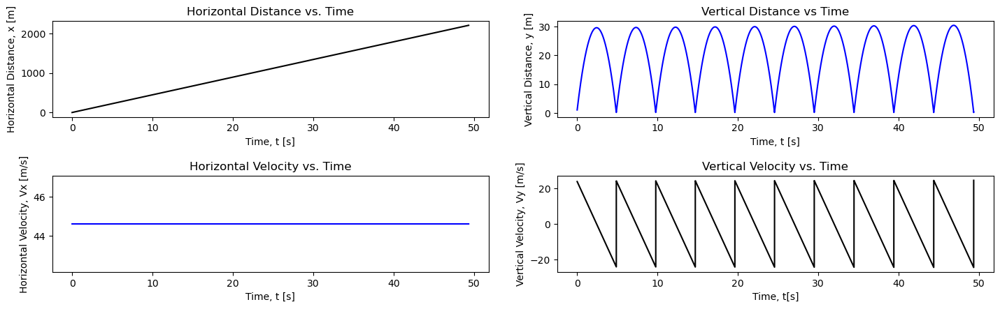
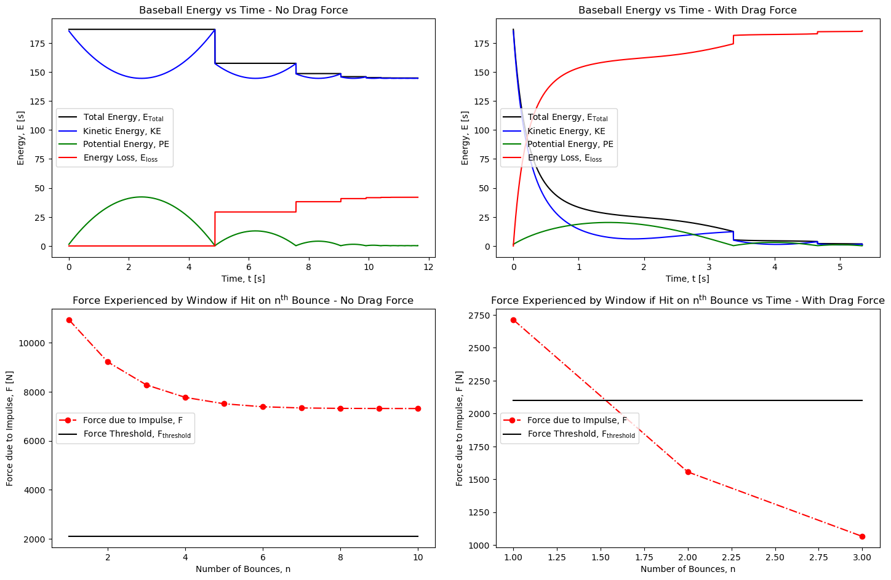

# Projectile Motion with Drag

Numerical simulation of 2D projectile motion with the ability to include drag forces using a custom Euler-method ODE solver.

## Overview

This project models the 2D motion of a projectile under the influence of gravity and drag forces, with the goal of modelling how initial values and drag forces affect projectile trajectory and impact dynamics.

The projectile modelled us a baseball using initial values of launch velocity and angle gathered from recent MLB home-run statistics, and observes how increasing model complexity affects the impact dynamics, and more concretely estimates: whether baseball impact exceeds an estimated force threshold to break a car windshield. The impact of the baseball bouncing off of the concrete in the parking lot before making contact with the windshield is also investigated.

Validation of the model was done through incrementally increasing the complexity of the model by changing the characteristics of the collisions (elastic vs. inelastic, changing the coefficient of restitution) and by increasing the complexity of the model, first modelling completely elastic collisions, then inelastic collisions in the absence of drag forces, and finally inelastic collisions with the inclusion of drag forces. Windshield collisions were taken to be orthogonal to the path of the baseball, however the code was written to be modular and adaptable, and can be adapted for a range of windshield angles if needed.

## Methods

This project implements a generalized 2D physics simulation framework in Python for modeling projectile motion, collisions, and energy dynamics. The framework is designed to be modular and reusable, allowing objects with arbitrary mass, radius, drag coefficient, and initial conditions to interact under customizable physical forces.

Key Components:
- Object_Model class: Represents individual projectiles with customizable mass, radius, cross-sectional area, drag coefficient, and total object energy. Stores arrays for projectile position and velocity for each time-step, as well as an array of force imparted due to impact for each bounce of the projectile.
- System_Model class: Represents system in which the Object_model class exists with customizable gravitational acceleration and air density. Allows for defining a range of window angles for simulated vehicles, and defines actions to take upon model iteration and impact within the system.
- Numerical Integration: uses Euler-method to update the position and velocity after each time-step dt; checks at each time-step for collision in order to update velocity magnitude and direction accordingly, determined by system's collision type and coefficient of restitution
- Energy tracking: tracks total system energy due to the effects of collision type and the inclusion (or not) of drag forces.
- Flexible configuration: most system configurations (projectile object parameters, system parameters) are user-customizable to allow for a wide range of situations and objects to be simulated without neccessitating changes to the core code.

## Repository Structure

'''
projectile-motion\
- projectile_motion_analysis.ipynb.    # Narrative and phase space analysis of simulations; includes generated plots
- projectile_motion_model.py           # Core classes and functions for the simulation
- README.md                            # This file
'''

## Requirements

Required Python Libraries include:
- Python 3
- Numpy
- Matplotlib

## How to Run

Open projectile_motion_analysis.ipynb and run all cells to simulate all systems included within the narrative. Running simulations using other parameters may be done using projectile_motion_model.py and by copying the sections "Constant Values used by System_Model and Object_Model" and the sections "Code to Run ... ", "Code for Graphs of (Motion / Energy and Force due to Impulse)" from any of the Models in "projectile_motion_analyis.ipybn" and making the desired modifications to the system/object parameters.

## Example Output

